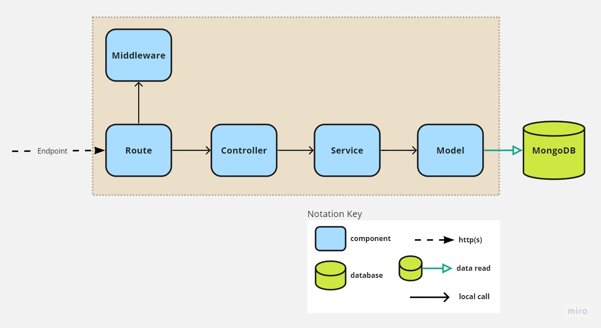

# Match4Action API

## Getting Started

1. First, make sure your .env file is filled with dev parameters.
2. To install packages:
    ```npm install```
3. Run the development server:
    ```npm run dev```
4. Open http://localhost:3003/api-doc with your browser to see the API documentation

## Technologies
* Node.js
* MongoDB with Mongoose
* TypeScript
* Express.js & Express.js middleware
* Zod validation

## Data flow Architecture


## Authentication flow
TODO

## How to run tests
We are using Jest to API contract tests.
1. To run the tests: 
    ```npm run test```

## API Documentation
We are using swagger-jsdoc and swagger-ui-express to document APIs.
Resources that can help to write documentation:
* https://github.com/Surnet/swagger-jsdoc/
* https://www.youtube.com/watch?v=5aryMKiBEKY
* https://github.com/TomDoesTech/REST-API-Tutorial-Updated/blob/main/README.md

To import API docs into Postman, import a new collection using the url http://localhost:3003/api-doc.json

# Deployment
TODO


